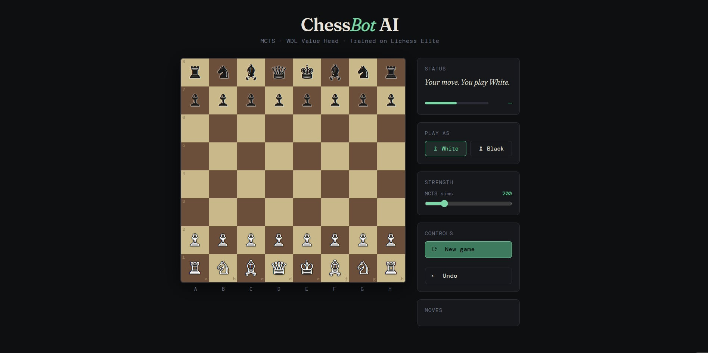
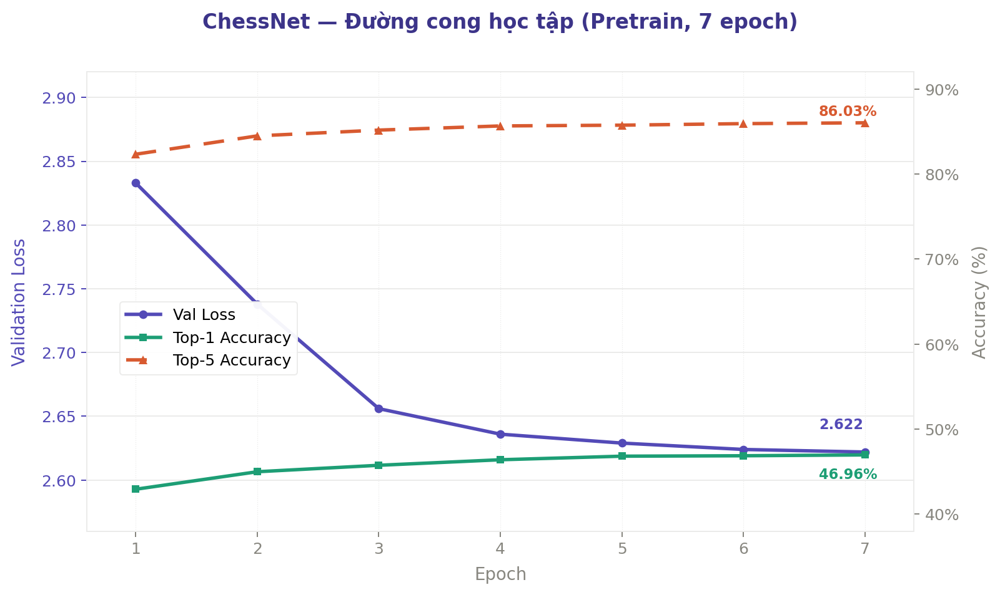

# ♟️ ChessNet — Huấn luyện mô hình cờ vua

Dự án cuối kỳ môn **Cơ sở Trí tuệ Nhân tạo** — Trường Đại học Công nghệ, ĐHQGHN.

Xây một AI cờ vua từ đầu lấy cảm hứng từ AlphaZero: đầu tiên cho nó học từ 250k ván của các kỳ thủ chuyên nghiệp, sau đó thả ra tự chơi với chính mình để tiếp tục cải thiện. Kèm theo web app Flask để ai cũng có thể vào thử sức.

> 📄 **Báo cáo đầy đủ:** [Chessbot_report.pdf](./Chessbot_report.pdf)

---

## Mục lục
- [Pipeline tổng quan](#pipeline-tổng-quan)
- [Chạy trên Kaggle](#chạy-trên-kaggle)
- [Web App](#web-app)
- [Kiến trúc mạng ChessNet](#kiến-trúc-mạng-chessnet)
- [Self-Play & Học tăng cường](#self-play--học-tăng-cường)
- [Kết quả](#kết-quả)
- [Thành viên](#thành-viên)

---
## Pipeline tổng quan

```
[250k ván PGN — Lichess Elite]
           │
           ▼
   Pretrain 
   AdamW + Warmup + CosineAnnealing
   Policy: Cross-Entropy
   Value:  Cross-Entropy WDL
           │
           ▼
       Best Model ◄──────────────────────┐
           │                             │ Win Rate ≥ 55% → update
           ▼                             │
       Self-play                         │
      Batched MCTS                       │
           │                             │
           ▼                             │
   RL Training: 3 epoch                  │
   Replay buffer 4 iter + weighted       │
           │                             │
           ▼                             │
   Eval: 40 ván, khai cuộc ngẫu nhiên ───┘
   (lặp 15 iterations)
```

## Chạy trên Kaggle

### Yêu cầu
Tài khoản Kaggle free — GPU T4 × 2, ~30h/tuần.

### Các bước

**1. Upload notebook**

Vào [kaggle.com/code](https://kaggle.com/code) → **New Notebook** → **File** → **Import Notebook** → chọn `chesskaggle.ipynb`.

**2. Bật GPU T4 × 2**

Trong notebook: **Settings** (góc phải) → **Accelerator** → **GPU T4 × 2**.

**3. Add Dataset**

Dataset:

Trong Kaggle Notebook:
- Nhấn **Add Input**
- Tìm `alinhtrng/chesss`
- Nhấn **Add**

Dataset sẽ được mount tại:

```python
/kaggle/input/chesss
```

**4. Chỉnh CONFIG theo ý muốn**

Config pretrain

```python
# =========================
# MODEL ARCHITECTURE
# =========================

CHANNELS = 64 # Số kênh (feature maps) trong mạng.

RES_BLOCKS = 6 # Số Residual Block.

ATTN_HEADS = 4 # Số attention heads trong Multi-Head Attention.

# Chèn 1 Attention Block sau mỗi 3 Residual Blocks.
# Với RES_BLOCKS=6:
# Block1 -> Block2 -> Block3 -> Attention
# Block4 -> Block5 -> Block6 -> Attention

ATTN_EVERY = 3

BATCH_SIZE      = 512          # Số position được đưa vào model mỗi lần update gradient.
  
LR_PRETRAIN     = 1e-3         # learning rate
EPOCHS_PRETRAIN = 7            # số epoch rong pretrain
MAX_PGN_GAMES   = 250_000      # số game được train
WARMUP_STEPS    = 1000         # Linear warmup trong ~1000 bước đầu
VALUE_WEIGHT    = 1.0          # Trọng số loss của Value Head
RESUME_EPOCH    = 7
```

```python
NUM_SELF_PLAY_GAMES  = 128     # Số ván self-play sinh ra mỗi vòng RL.
MCTS_SIMS_SELFPLAY   = 400    # Số lần mô phỏng MCTS cho mỗi nước khi self-play.
MCTS_SIMS_EVAL       = 400     # Số lần mô phỏng MCTS khi đánh giá model.
MAX_GAME_MOVES       = 150    # Giới hạn số nước tối đa trong một ván.
TEMP_THRESHOLD       = 30     # Sau nước thứ 30 sẽ chọn nước đi ít ngẫu nhiên hơn.

RL_BATCH_SIZE        = 256    # Số mẫu dùng trong mỗi lần cập nhật gradient ở RL.
RL_LR                = 1e-4   # Learning rate khi huấn luyện bằng self-play có thể giảm đi từ iter 10-15 để train hiệu quả hơn .
RL_EPOCHS            = 5      # Số lần học lại toàn bộ dữ liệu self-play mỗi vòng.
RL_WEIGHT_DECAY      = 1e-4   # Hệ số regularization để giảm overfitting.
RL_WARMUP_STEPS      = 100    # Số bước tăng dần learning rate lúc bắt đầu RL.

EVAL_GAMES           = 40     # Số ván dùng để so sánh model mới và model tốt nhất.
WIN_THRESHOLD        = 0.55   # Tỷ lệ thắng tối thiểu để chấp nhận model mới.
RL_ITERATIONS        = 25     # Số vòng lặp self-play → train → đánh giá.
```

**5. Chạy**

Nhấn **Save Version -> Save and run** 

Model lưu tại `/kaggle/working/rl/best_model.pt` → tab **Output** để download.

**6. Resume sau khi hết giờ**

```python
RESUME_EPOCH = 5      # tiếp pretrain từ epoch đã lưu
run_train()

run_rl_loop(start_iteration=3)   # tiếp RL từ iteration đã lưu
```

---

## Web App

Flask server + UI bàn cờ, chơi trực tiếp qua trình duyệt.

### Chạy local

```bash
git clone https://github.com/htr08/2526II_AIT2004_4-CSAI-Project-ChessAI
cd Chessweb
```

Tạo môi trường ảo:
```bash
# Linux / macOS
python3 -m venv venv && source venv/bin/activate

# Windows (PowerShell)
python -m venv venv
venv\Scripts\Activate.ps1

# Windows (Command Prompt)
python -m venv venv
venv\Scripts\activate.bat
```

```bash
pip install -r requirements.txt
# đặt best_model.pt vào thư mục gốc
python app.py
# → http://127.0.0.1:5000
```

Thoát: `deactivate`

### Biến môi trường

| Biến | Mặc định | Mô tả |
|------|----------|-------|
| `MODEL_PATH` | `best_model.pt` | Đường dẫn đến file model |
| `MCTS_SIMS` | `200` | Số simulations mỗi nước |
| `C_PUCT` | `2.0` | Exploration constant |

### API

```
POST /api/move         { fen, last_move, sims }  →  { move, eval }
POST /api/legal_moves  { fen }                   →  { moves, is_game_over }
GET  /api/health                                 →  { status, device, sims }
```
### Giao diện



---

## Kiến trúc mạng ChessNet

### Mã hóa đầu vào — tensor (15, 8, 8)

Bàn cờ không được đưa vào dưới dạng ký hiệu chữ mà được mã hóa thành 15 lớp ảnh 8×8 xếp chồng nhau:

| Kênh | Nội dung |
|------|----------|
| 1–6  | Vị trí 6 loại quân Trắng (Tốt, Mã, Tượng, Xe, Hậu, Vua) |
| 7–12 | Vị trí 6 loại quân Đen |
| 13   | Tất cả = 1 (flag bên đang đến lượt) |
| 14–15| Ô xuất phát và ô đích của nước đi liền trước |

**Canonical Flip:** khi đến lượt Đen, bàn cờ lật dọc và màu quân hoán đổi. Mạng chỉ cần học một chiến lược chung thay vì học riêng cho cả hai màu — giảm một nửa độ phức tạp mà không mất thông tin gì.

**Lọc dữ liệu PGN:** chỉ giữ ván ≥ 40 lượt, bỏ 8–10 lượt đầu (khai cuộc thư viện) và 8–10 lượt cuối (tàn cuộc hỗn loạn). Lấy 1 vị trí mỗi 2 lượt với offset ngẫu nhiên để mỗi ván chỉ chứa toàn Trắng hoặc toàn Đen, đảm bảo cân bằng tỉ lệ sau Canonical Flip trên toàn dataset.

### Sơ đồ kiến trúc

```
Input (15, 8, 8)
      │
      ▼
Conv 3×3 (15→64) → BN → ReLU
      │
      ▼
┌─────────────────────────────────────┐
│  ResBlock 1                         │
│  ResBlock 2                         │
│  ResBlock 3                         │
│     + BoardAttention ①              │  ← Self-Attention 4 heads sau block 3
│  ResBlock 4                         │
│  ResBlock 5                         │
│  ResBlock 6                         │
│     + BoardAttention ②              │  ← Self-Attention 4 heads sau block 6
└──────────────────┬──────────────────┘
                   │
           Feature map (64×8×8)
                   │
        ┌──────────┴──────────┐
        ▼                     ▼
  Policy Head            Value Head
  Conv1×1 (64→32)        Conv1×1 (64→8)
  BN → ReLU              BN → ReLU
  Flatten (2048)         Flatten (512)
  FC → 4096 logits       FC (512→64) → ReLU
  Legal Mask (−∞)        FC (64→3)
  Softmax                Softmax
        │                     │
  P(nước đi)       [P(Win), P(Draw), P(Loss)]
                   v = P(Win) − P(Loss) ∈ [−1, 1]
```

Mỗi ResBlock có cấu trúc:
```
output = ReLU( Conv2( Conv1(x) ) × w_SE + x )
```
`w_SE` là trọng số từ SE gate, `+ x` là skip connection.

| Thông số | Giá trị |
|----------|---------|
| Channels | 64 |
| ResBlocks | 6 |
| Attention heads | 4 |
| Attention sau mỗi | 3 blocks |
| Tổng tham số | ~8.9M |


### Kỹ thuật huấn luyện

| Kỹ thuật | Chi tiết |
|----------|----------|
| AdamW | weight decay 1e-4, xử lý L2 chuẩn hơn Adam thuần cho mô hình có Attention |
| Mixed Precision (AMP) | float16 cho forward/backward, tăng ~2× tốc độ, tiết kiệm VRAM |
| GradScaler | tránh gradient underflow khi dùng float16 |
| Gradient Clipping | L2-norm ≤ 1.0, ngăn exploding gradient |
| Warmup + Cosine LR | warmup 1000 bước → cosine decay; LR: 1e-3 → 1e-5 |
| Chunk DataLoader | chia 9M positions thành chunk ~30k, tránh tràn RAM |

---

## Self-Play & Học tăng cường

### MCTS — Monte Carlo Tree Search

Mạng không chọn ngay nước từ policy head mà "suy nghĩ trước" qua 400 simulations. Mỗi simulation gồm 4 bước:

**① Selection** — đi xuống cây theo PUCT score:
```
PUCT(s,a) = Q(s,a) + c_puct × P(s,a) × √N_parent / (1 + N(s,a))

Q(s,a)   : chất lượng trung bình từ các sim trước (khai thác)
P(s,a)   : prior từ policy head (định hướng ban đầu)
N(s,a)   : số lần đã thăm — node ít thăm được ưu tiên (khám phá)
c_puct   : 2.0
```

**② Expand** — tạo node con từ các nước hợp lệ, gán prior từ policy head

**③ Evaluate** — gọi mạng tại leaf node → `v = P(Win) − P(Loss)`

**④ Backprop** — cập nhật Q ngược lên root, đảo dấu tại mỗi nút cha vì mỗi lượt là của đối thủ

Sau đủ simulations, policy target được rút từ visit counts:
```
π(a|s) = N(s,a) / Σ N(s,b)
```
Phân phối này tốt hơn raw policy vì đã được "lọc" qua hàng trăm lần thử nghiệm thực tế.

### Dirichlet Noise — buộc mạng phải khám phá

Nếu không có nhiễu, mọi ván self-play sẽ đi theo cùng một đường — mạng chỉ ôn lại những gì đã biết và không tiến thêm được. Giải pháp là thêm nhiễu ngẫu nhiên vào prior của **root node** trước mỗi lượt tìm kiếm:

```
P'(a) = (1 − ε) × P(a) + ε × η(a),   η ~ Dir(α)

ε = 0.25   (25% nhiễu, 75% prior gốc)
α = 0.3    (nhiễu phân tán đều, buộc khám phá nhánh ít quen)
```

Nhiễu chỉ thêm vào root — các node sâu hơn là mô phỏng giả định, thêm nhiễu ở đó làm giảm chất lượng đánh giá mà không có lợi gì.

### Batched MCTS — speedup 8–12×

Vấn đề: MCTS thông thường gọi GPU với batch=1 mỗi simulation → 128 ván × 400 sims = 51.200 lần gọi đơn lẻ → GPU gần như idle.

Giải pháp: chạy 128 ván đồng thời, gom tất cả leaf nodes thành 1 batch mỗi step:

```
128 ván chạy song song
      │
      ▼
Selection × 128          (CPU — traverse xuống leaf)
      │
      ▼
Gom 128 leaves → tensor (128, 15, 8, 8)
      │
      ▼
1 forward pass GPU       ← thay vì 51.200 lần riêng lẻ
      │
      ▼
Expand + Backprop × 128  (CPU)
```

Ba tối ưu thêm giúp đạt speedup thực tế:
- Build legal mask trên NumPy (CPU) → push GPU 1 lần, tránh sync storm
- Dùng `push/pop` trực tiếp thay vì `board.copy()` tốn kém
- Tái sử dụng engine object, chỉ reinit root sau mỗi nước

### Vòng lặp RL 

```
① Self-play
   128 ván × 400 sims 
   30 nước đầu : sample theo π (temperature=1) → đa dạng khai cuộc
   Từ nước 30  : greedy (visit count cao nhất) → đảm bảo chất lượng ván

② Train
   Copy best model → 3 epoch AdamW
   Replay buffer: giữ 4 iter gần nhất
   WeightedRandomSampler: cũ=0.25 → mới=1.0  (replacement=True)
   Dynamic warmup = max(1, total_steps // 10)

   Policy loss : L = −Σ π_mcts(a|s) × log π_net(a|s)
   Value loss  : Cross-Entropy WDL (nhãn từ kết quả ván thực)

③ Eval
   40 ván (20 Trắng + 20 Đen), khai cuộc ngẫu nhiên từ 20 lines
   add_noise=True để phá tính tất định
   Win Rate = (W + 0.5×D) / N

④ Update
   Win Rate ≥ 55% → thay best model
   Ngưỡng 55% thay vì 50% vì 40 ván vẫn có variance đáng kể
```

---

## Kết quả

### Pretrain — Học có giám sát (7 epoch, 250k ván Lichess Elite)

| Chỉ số | Giá trị |
|--------|---------|
| Top-1 Accuracy | 46.96% |
| Top-5 Accuracy | 86.03% |
| Val Loss (epoch cuối) | 2.622 |
| Winrate vs Stockfish ELO 1400 | 54% / 50 ván |

Val Loss giảm từ 2.833 (epoch 1) xuống 2.622 (epoch 7), hội tụ ổn định không có dấu hiệu overfitting. Top-5 86% cho thấy trong phần lớn tình huống, nước đúng nằm trong top 5 mạng đề xuất — nền tảng chiến thuật đủ tốt để bước vào RL.



---

### Sau học tăng cường (23 iterations tự chơi)

**Tổng quan:**

| Giai đoạn | Mô tả | ELO ước tính |
|-----------|-------|--------------|
| Pretrain (SL) | 7 epoch, policy thuần không có MCTS | ≈ 1400 |
| Sau RL (800 sims) | 23 iter — 8 iter đầu: 128 ván × 200 sims; 15 iter sau: 128 ván × 400 sims; tổng 2.432 ván self-play | ≈ 1875 |

Học tăng cường giúp mô hình tăng thêm **+475 ELO** so với pretrain — chỉ từ việc tự chơi với chính mình, không cần thêm dữ liệu người.

**Kết quả đấu với Stockfish (100 ván/dòng):**

| Sims | Đối thủ | Thắng | Hòa | Thua | Winrate | ELO ước tính |
|------|---------|-------|-----|------|---------|--------------|
| 200 | Stockfish 1600 | 67 | 5 | 28 | 0.695 | ≈ 1743 |
| 200 | Stockfish 1700 | 50 | 13 | 37 | 0.565 | ≈ 1726 |
| 400 | Stockfish 1600 | 83 | 3 | 14 | 0.845 | ≈ 1837 |
| 400 | Stockfish 1800 | 50 | 7 | 43 | 0.535 | ≈ 1809 |
| 800 | Stockfish 1800 | 57 | 9 | 34 | 0.615 | ≈ 1874 |

ELO được tính theo công thức: `ΔELO = -400 × log₁₀(1/W - 1)` với `W = (Thắng + 0.5×Hòa) / Tổng`.

---

## Thành viên


| Họ và tên | 
| :--- | 
| Trương Ái Linh |
| Nguyễn Quốc Khánh | 
| Cao Huy Hòa | 
| Nguyễn Thị Hiền Trang | 

---
