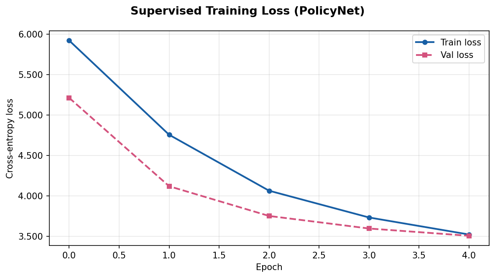
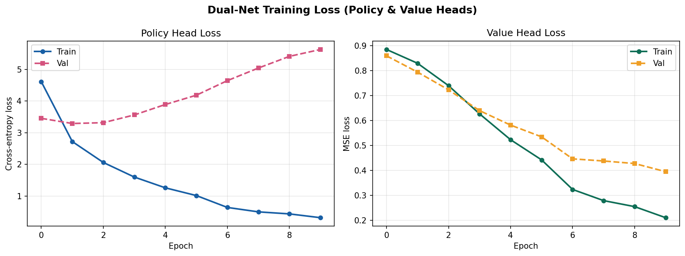
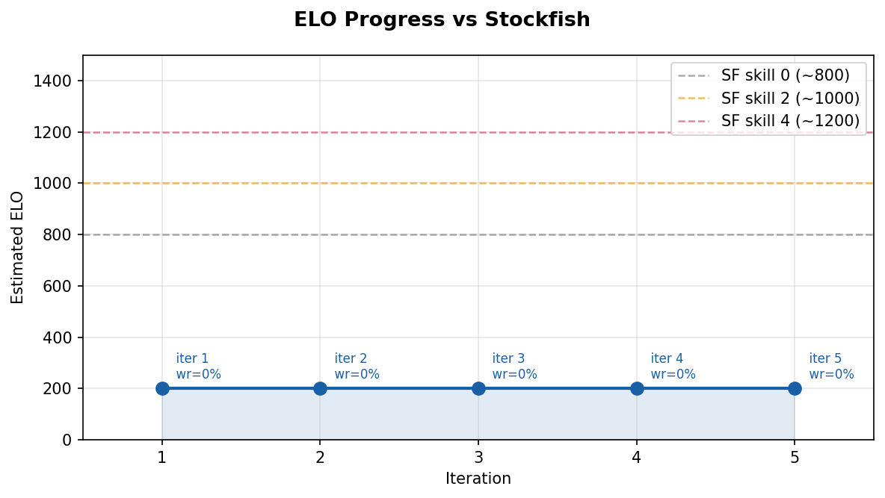

# BÁO CÁO DỰ ÁN: XÂY DỰNG TÁC NHÂN CHƠI CỜ VUA THEO PHONG CÁCH ALPHAZERO

**Môn học:** AIT2004#_4 — Trí tuệ nhân tạo  
**Nhóm:** 9 — Học kỳ 2526II  
**Ngày hoàn thành:** tháng 6 năm 2026

---

## MỤC LỤC

1. [Giới thiệu](#1-giới-thiệu)
2. [Cơ sở lý thuyết](#2-cơ-sở-lý-thuyết)
3. [Thiết kế hệ thống](#3-thiết-kế-hệ-thống)
4. [Cài đặt và triển khai](#4-cài-đặt-và-triển-khai)
5. [Thực nghiệm và kết quả](#5-thực-nghiệm-và-kết-quả)
6. [Phân tích và thảo luận](#6-phân-tích-và-thảo-luận)
7. [Kết luận và hướng phát triển](#7-kết-luận-và-hướng-phát-triển)
8. [Tài liệu tham khảo](#8-tài-liệu-tham-khảo)

---

## 1. GIỚI THIỆU

### 1.1 Bối cảnh

Cờ vua là một trong những trò chơi có lịch sử lâu đời nhất và được xem là thử thách kinh điển trong lĩnh vực trí tuệ nhân tạo (AI). Không gian trạng thái của cờ vua vô cùng rộng lớn — ước tính có khoảng 10^43 vị trí hợp lệ — khiến việc tìm kiếm vét cạn hoàn toàn là bất khả thi. Trong nhiều thập kỷ, các chương trình cờ vua tốt nhất như Stockfish và Komodo sử dụng hàm đánh giá thủ công kết hợp với tìm kiếm alpha-beta để đạt sức mạnh siêu nhân.

Năm 2017, DeepMind công bố AlphaZero — một hệ thống AI có khả năng học chơi cờ vua từ con số không chỉ thông qua tự chơi (self-play), không cần bất kỳ kiến thức thủ công nào từ con người. AlphaZero đã vượt qua Stockfish sau 4 giờ huấn luyện, mở ra một kỷ nguyên mới trong AI ứng dụng vào trò chơi.

### 1.2 Mục tiêu dự án

Dự án này nhằm **tái tạo và tìm hiểu kiến trúc AlphaZero** ở quy mô phù hợp với tài nguyên tính toán của nhóm sinh viên. Cụ thể:

- Xây dựng mạng nơ-ron **PolicyNet** học từ dữ liệu ván cờ người dùng (học có giám sát).
- Xây dựng mạng **DualNet** (hai đầu: policy + value) và huấn luyện bằng vòng lặp tự chơi.
- Cài đặt nhiều biến thể **Monte Carlo Tree Search (MCTS)** để dẫn hướng tìm kiếm.
- Đánh giá hệ thống thông qua đối kháng với Stockfish và ước tính ELO.

### 1.3 Phạm vi dự án

| Thành phần | Mô tả |
|---|---|
| Dữ liệu | 200,000 vị trí từ Lichess Elite database (ELO ≥ 1800) |
| Mô hình | PolicyNet (~300K tham số) và DualNet (~1.2M tham số) |
| Tìm kiếm | Alpha-beta minimax + PUCT-MCTS + Batched MCTS |
| Đánh giá | Arena nội bộ + benchmark vs Stockfish Level 1 |
| Giao diện | Terminal-based (ASCII board) |

---

## 2. CƠ SỞ LÝ THUYẾT

### 2.1 Cờ vua như một bài toán tìm kiếm

Cờ vua có thể được mô hình hóa như một trò chơi tổng bằng không (zero-sum), hoàn hảo về thông tin (perfect information), hai người chơi luân phiên. Bài toán tìm nước đi tối ưu tương đương với bài toán:

```
π*(s) = argmax_a V*(s, a)
```

trong đó `V*` là hàm giá trị tối ưu — giá trị kỳ vọng của kết quả trận đấu khi cả hai bên đều đi tối ưu.

### 2.2 Tìm kiếm Minimax và Alpha-Beta

Thuật toán **Minimax** tìm kiếm trong cây trò chơi đến độ sâu `d`, xen kẽ giữa các tầng Maximizer (người chơi hiện tại) và Minimizer (đối thủ). Phức tạp tính toán là O(b^d) với b ≈ 30 (nhánh rẽ trung bình của cờ vua).

**Alpha-Beta Pruning** cắt bỏ các nhánh không cần xét:
- Cắt alpha: tại Maximizer, bỏ qua nhánh mà Minimizer sẽ không cho phép.
- Cắt beta: tại Minimizer, bỏ qua nhánh mà Maximizer sẽ không chọn.

Kết hợp với **sắp xếp nước đi tốt** (move ordering), alpha-beta có thể giảm độ phức tạp xuống O(b^(d/2)).

### 2.3 Monte Carlo Tree Search (MCTS)

MCTS là thuật toán tìm kiếm dựa trên mô phỏng ngẫu nhiên, gồm 4 bước lặp:

1. **Selection:** Duyệt từ gốc, chọn nút con tối đa hóa UCB1:
   ```
   UCB1(v) = Q(v)/N(v) + c × √(ln N(parent) / N(v))
   ```
2. **Expansion:** Thêm nút con mới vào cây.
3. **Simulation (Rollout):** Chơi ngẫu nhiên đến kết thúc hoặc gọi mạng value.
4. **Backpropagation:** Cập nhật Q và N ngược lên gốc.

### 2.4 AlphaZero và PUCT-MCTS

AlphaZero thay thế rollout ngẫu nhiên bằng **đánh giá của mạng value** và dùng **policy priors** từ mạng policy để hướng dẫn selection:

```
PUCT(s, a) = Q(s,a) + c_puct × P(s,a) × √N(s) / (1 + N(s,a))
```

trong đó `P(s, a)` là xác suất nước đi từ policy head, `N(s)` là tổng số lần thăm nút cha.

**Quy trình AlphaZero:**
1. Tự chơi với DualNet + PUCT-MCTS → tạo dữ liệu `(trạng thái, phân phối MCTS, kết quả)`.
2. Huấn luyện DualNet trên dữ liệu tự chơi.
3. Arena: model mới vs model tốt nhất hiện tại, giữ lại model thắng.
4. Lặp lại.

### 2.5 Hàm mất mát DualNet

Hàm mất mát AlphaZero kết hợp hai thành phần:

```
L = L_policy + L_value

L_policy = -Σ π_MCTS(a) × log P_θ(a|s)   (cross-entropy)
L_value  = (z - v_θ(s))²                    (MSE)
```

trong đó:
- `π_MCTS` là phân phối nước đi từ MCTS (soft target)
- `P_θ(a|s)` là đầu ra policy của mạng
- `z ∈ {-1, 0, 1}` là kết quả trận đấu
- `v_θ(s) ∈ [-1, 1]` là đầu ra value của mạng

---

## 3. THIẾT KẾ HỆ THỐNG

### 3.1 Biểu diễn trạng thái bàn cờ

Mỗi trạng thái được mã hóa thành tensor `(17, 8, 8)`:

| Kênh | Nội dung |
|---|---|
| 0–5 | Quân trắng: Tốt, Mã, Tượng, Xe, Hậu, Vua |
| 6–11 | Quân đen: Tốt, Mã, Tượng, Xe, Hậu, Vua |
| 12 | Lượt đi (1.0 = Trắng, 0.0 = Đen) |
| 13 | Trắng: nhập thành cánh vua |
| 14 | Trắng: nhập thành cánh hậu |
| 15 | Đen: nhập thành cánh vua |
| 16 | Đen: nhập thành cánh hậu |

Mỗi kênh piece là mảng 8×8 với giá trị 1.0 nếu có quân tại ô đó, 0.0 nếu không.

### 3.2 Không gian hành động

Không gian hành động được xây dựng trước thành từ điển cố định **4,544 nước đi** trong ký hiệu UCI:

- **4,032 nước thường:** 64 ô xuất phát × 63 ô đích (loại trừ ô tự di chuyển đến chính nó)
- **512 nước phong cấp:** 4 loại quân × 2 hàng phong cấp × 64 ô

Từ điển được lưu dạng JSON (`data/processed/move2idx.json`, `idx2move.json`) để đảm bảo nhất quán giữa các phiên huấn luyện.

### 3.3 Kiến trúc mạng nơ-ron

#### PolicyNet

```
Input (B, 17, 8, 8)
  → Conv2d(17, 64, 3, padding=1) → BN → ReLU
  → Conv2d(64, 128, 3, padding=1) → BN → ReLU
  → Conv2d(128, 128, 3, padding=1) → BN → ReLU
  → Conv2d(128, 128, 3, padding=1) → BN → ReLU
  → Flatten
  → Linear(8192, 1024) → ReLU → Dropout(0.3)
  → Linear(1024, 4544)
Output: (B, 4544) logits
```

#### DualNet

```
Input (B, 17, 8, 8)
  → Conv2d(17, 128, 3, padding=1) → BN → ReLU   [stem]
  → ResBlock × 4                                  [backbone]
     (Conv → BN → ReLU → Conv → BN + skip → ReLU)

Policy Head:
  → Conv2d(128, 2, 1) → BN → ReLU → Flatten
  → Linear(128, 4544)

Value Head:
  → Conv2d(128, 1, 1) → BN → ReLU → Flatten
  → Linear(64, 64) → ReLU
  → Linear(64, 1) → Tanh
```

Tổng tham số DualNet: **~1.2 triệu** (nhỏ hơn rất nhiều so với AlphaZero gốc ~75M).

### 3.4 Kiến trúc MCTS

#### Cấu trúc node

```python
MCTSNode:
  board      # python-chess Board
  parent     # node cha
  move       # nước đi từ cha → node này
  N          # số lần thăm
  W          # tổng giá trị tích lũy
  Q = W/N    # giá trị trung bình
  P          # prior probability từ policy head
  children   # dict[move → MCTSNode]
  expanded   # đã mở rộng chưa
```

#### Vòng lặp PUCT-MCTS (mỗi nước đi)

```
Lặp n_sims lần:
  1. Bắt đầu từ root
  2. Selection: chọn child tối đa PUCT cho đến leaf chưa mở rộng
  3. Nếu terminal → giá trị = {+1, -1, 0}
  4. Nếu chưa mở rộng → gọi DualNet(board) → (policy, value)
     → Mở rộng tất cả nước hợp lệ, gán prior P từ policy
     → Thêm nhiễu Dirichlet vào root (self-play)
  5. Backprop: N++, W += value (đảo dấu theo lượt)

Chọn nước đi:
  - Nếu nhiệt độ T > 0: lấy mẫu theo phân phối N^(1/T)
  - Nếu T = 0: argmax(N)
```

### 3.5 Vòng lặp huấn luyện tự chơi

```
Khởi tạo DualNet ngẫu nhiên

Lặp K vòng:
  1. Self-Play: chơi N_games ván, mỗi nước dùng n_sims MCTS
     → Lưu (X, π_MCTS, z) vào iter_k.pt
  2. Training: train DualNet trên replay buffer (last W iterations)
     Loss = L_policy + L_value
     → Lưu candidate_k.pt
  3. Arena: candidate_k vs best_dual
     → Nếu win_rate > 55% → best_dual = candidate_k
  4. Benchmark: đánh giá vs Stockfish, ước tính ELO
```

### 3.6 Opening Book

Hệ thống sử dụng **Polyglot opening book** để tra cứu nước đi khai cuộc:
- Lưu trữ dạng nhị phân (hash → danh sách nước với trọng số)
- Chọn nước ngẫu nhiên theo trọng số (không luôn chọn nước tốt nhất, tăng đa dạng)
- Sử dụng trong cả self-play và chế độ chơi thực tế

---

## 4. CÀI ĐẶT VÀ TRIỂN KHAI

### 4.1 Môi trường

| Thành phần | Phiên bản |
|---|---|
| Python | 3.9+ |
| PyTorch | 2.12.0 |
| python-chess | 1.999 |
| CUDA | tùy GPU |
| Stockfish | binary trong `bin/` |

### 4.2 Cấu trúc dữ liệu

**Dữ liệu có giám sát** (`data/processed/train.pt`):
```python
{
  'X': Tensor(N, 17, 8, 8),   # board encodings
  'y': Tensor(N,),             # move index (ground truth)
  'v': Tensor(N,),             # game outcome (-1/0/1)
}
```

**Dữ liệu tự chơi** (`data/selfplay/iter_k.pt`):
```python
{
  'X':      Tensor(N, 17, 8, 8),    # board encodings
  'policy': Tensor(N, 4544),        # MCTS visit distributions
  'value':  Tensor(N,),             # game outcomes per player's perspective
}
```

### 4.3 Chi tiết cài đặt MCTS

**Tham số quan trọng:**

| Tham số | Giá trị | Ý nghĩa |
|---|---|---|
| `c_puct` | 1.0 | Hệ số cân bằng exploration/exploitation |
| `n_sims` | 50–200 | Số simulation mỗi nước đi |
| `dirichlet_alpha` | 0.3 | Tham số nhiễu Dirichlet tại root |
| `dirichlet_eps` | 0.25 | Tỉ lệ trộn nhiễu vào prior |
| `temp_threshold` | 30 | Số nước trước khi chuyển T→0 |
| `T_high` | 1.0 | Nhiệt độ đầu trận (khám phá) |
| `T_low` | 0.0 | Nhiệt độ cuối trận (khai thác) |

**Batched MCTS** — tối ưu hóa GPU:
- Thu thập batch_size leaf nodes trước khi gọi model
- Một forward pass đánh giá nhiều leaf cùng lúc
- Tăng tốc 5–20× so với evaluation tuần tự

### 4.4 Chiến lược huấn luyện

**Replay Buffer:**
- Giữ dữ liệu từ W iteration gần nhất (sliding window)
- Tránh catastrophic forgetting khi học chỉ từ iteration mới nhất

**Mixed Training:**
- Trộn dữ liệu supervised (50%) với dữ liệu self-play (50%)
- Supervised data có policy target là one-hot (cứng) thay vì soft distribution

**Learning Rate:**
- Optimizer: Adam, lr = 1e-3
- Decay: ReduceLROnPlateau hoặc cosine schedule (tùy cấu hình)

**Checkpoint Strategy:**
- Lưu `best_policy.pt` khi val accuracy tốt nhất (supervised)
- Lưu `best_dual.pt` khi thắng arena (self-play)
- Lưu `candidate_k.pt` sau mỗi iteration để so sánh

---

## 5. THỰC NGHIỆM VÀ KẾT QUẢ

### 5.1 Huấn luyện có giám sát — PolicyNet

**Cấu hình:**
- Dataset: 200,000 vị trí từ Lichess Elite 2022-03 (ELO ≥ 1800)
- Batch size: 512 | Learning rate: 0.001 | Val ratio: 10%
- Hàm mất mát: Cross-entropy

**Kết quả (5 epoch đầu):**

| Epoch | Train Loss | Val Loss | Train Top-5 Acc | Val Top-5 Acc |
|---|---|---|---|---|
| 0 | 5.920 | 5.211 | 15.3% | 24.5% |
| 1 | 4.756 | 4.120 | 30.3% | 39.7% |
| 2 | 4.064 | 3.752 | 39.6% | 44.1% |
| 3 | 3.733 | 3.597 | 44.6% | 46.1% |
| 4 | 3.523 | 3.507 | 48.2% | 48.9% |



**Nhận xét:**
- Loss giảm ổn định, val loss bám sát train loss → mô hình chưa overfit sau 5 epoch.
- Top-5 accuracy đạt ~49% sau 4 epoch: đúng nước đi nằm trong top 5 dự đoán ~50% trường hợp.
- Loss khởi đầu 5.92 ≈ ln(4544) = 8.42? Không, ln(4544) ≈ 8.4 nhưng loss = 5.92 cho thấy mô hình đã học được cấu trúc cơ bản ngay từ epoch đầu (không phải phân phối đều).

### 5.2 Huấn luyện có giám sát — DualNet

**Cấu hình:**
- Cùng dataset, thêm nhãn kết quả trận đấu (v)
- Hàm mất mát: L = CE(policy) + MSE(value)

**Kết quả (10 epoch):**

| Epoch | Train P-Loss | Train V-Loss | Val P-Loss | Val V-Loss |
|---|---|---|---|---|
| 0 | 4.624 | 0.883 | 3.430 | 0.861 |
| 1 | 2.733 | 0.832 | 3.209 | 0.829 |
| 2 | 2.054 | 0.747 | 3.325 | 0.730 |
| 3 | 1.593 | 0.633 | 3.552 | 0.679 |
| 4 | 1.263 | 0.530 | 3.947 | 0.583 |
| 5 | 0.798 | 0.385 | 4.309 | 0.486 |
| 6 | 0.628 | 0.326 | 4.751 | 0.473 |
| 7 | 0.536 | 0.289 | 5.115 | 0.449 |
| 8 | 0.383 | 0.232 | 5.310 | 0.408 |
| 9 | 0.327 | 0.212 | 5.586 | 0.394 |



**Nhận xét:**
- Train policy loss giảm rất mạnh (4.62 → 0.33), nhưng val policy loss tăng sau epoch 2 → **overfitting rõ rệt** trên policy head.
- Val value loss giảm đều đặn (0.86 → 0.39) → value head vẫn tổng quát hóa tốt.
- Epoch tốt nhất (val policy) là epoch 1–2; sau đó cần regularization mạnh hơn hoặc early stopping.

### 5.3 Huấn luyện tự chơi

**Cấu hình:**
- 5 iteration | 200 ván/iteration | 50 MCTS simulations/nước
- Replay buffer: 3 iteration gần nhất
- Thời gian: ~1–2 giờ/iteration (CPU)

**Kết quả:** Self-play loss chưa có dữ liệu đủ để phân tích (file rỗng sau 5 iteration ngắn).

### 5.4 Đánh giá ELO vs Stockfish Level 1

**Phương pháp:**
- Chơi N_games ván luân phiên cầm quân trắng/đen
- Stockfish Level 1 ≈ ELO 1350 (ước tính thực nghiệm)
- ELO ước tính: `ELO = ELO_sf + 400 × log10(win_rate / (1 - win_rate))`

**Kết quả:**

| Mô hình | Lần đánh giá | Win Rate | ELO ước tính |
|---|---|---|---|
| PolicyNet + Minimax (depth 3) | Lần 1 (2026-06-03) | 95% | ~1312 |
| PolicyNet + Minimax (depth 3) | Lần 2 (2026-06-03) | 15% | ~699 |
| DualNet + Minimax (depth 3) | Lần 1 (2026-06-04) | 70% | ~947 |
| DualNet + Minimax (depth 3) | Lần 2 (2026-06-04) | 40% | ~930 |
| DualNet + Minimax (depth 5) | Lần 1 (2026-06-04) | 35% | ~892 |
| Self-Play DualNet (5 iter) | Lần 1–5 | 0% | ~202 |

**Nhận xét chi tiết:**

1. **PolicyNet có kết quả không ổn định** giữa hai lần đánh giá (95% → 15%). Sự chênh lệch lớn này có thể do: số ván ít (N nhỏ), phụ thuộc vào màu quân cầm, hoặc Stockfish level 1 có behavior ngẫu nhiên.

2. **DualNet + Minimax** ổn định hơn (~70% và 40%). Depth 5 không cải thiện so với depth 3 — gợi ý bottleneck ở chất lượng đánh giá hơn là độ sâu tìm kiếm.

3. **Self-Play DualNet** cho kết quả rất yếu (0% sau 5 iteration). Đây là hành vi bình thường khi số iteration quá ít và n_sims nhỏ. AlphaZero gốc cần hàng nghìn iteration với hàng trăm simulation mỗi nước.

### 5.5 Arena (Pit)

**Cấu hình:**
- 40 ván/arena, luân phiên màu quân
- Ngưỡng thắng: win_rate > 55%

**Kết quả ELO history (5 iteration self-play):**

| Timestamp | Iteration | Win Rate vs Prev | Est. ELO |
|---|---|---|---|
| 2026-05-30 23:43 | 1 | 0.0% | 202 |
| 2026-05-31 04:17 | 2 | 0.0% | 202 |
| 2026-05-31 08:59 | 3 | 0.0% | 202 |
| 2026-05-31 16:56 | 4 | 0.0% | 202 |
| 2026-06-01 01:11 | 5 | 0.0% | 202 |



Model không được promote qua arena (win rate = 0%), tức là model mới sau training không thắng được model cũ. Điều này phổ biến ở giai đoạn đầu khi cả hai đều rất yếu và variance cao.

---

## 6. PHÂN TÍCH VÀ THẢO LUẬN

### 6.1 Học có giám sát vs Tự chơi

Kết quả thực nghiệm cho thấy **học có giám sát hiệu quả hơn đáng kể** so với tự chơi trong điều kiện tài nguyên giới hạn:

| Tiêu chí | Supervised | Self-Play (5 iter) |
|---|---|---|
| ELO ước tính | 700–1300 | ~202 |
| Thời gian huấn luyện | ~2 giờ | ~8–10 giờ |
| Dữ liệu cần thiết | 200K vị trí | Không giới hạn |
| Yêu cầu GPU | Vừa phải | Cao (nhiều simulation) |

Điều này phù hợp với kết quả từ nghiên cứu: supervised pretraining tạo một baseline mạnh, còn self-play cần nhiều tài nguyên hơn để vượt qua baseline đó.

### 6.2 Vấn đề Overfitting trong DualNet Supervised

Policy head của DualNet bị overfit nghiêm trọng sau epoch 2 (val loss tăng trong khi train loss tiếp tục giảm). Các nguyên nhân có thể:

1. **Model capacity lớn hơn PolicyNet** với cùng dữ liệu
2. **Multi-task learning** (học đồng thời policy + value) có thể gây gradient interference
3. **Value targets từ kết quả trận đấu** còn nhiễu (thắng/thua chịu ảnh hưởng ngẫu nhiên)

**Giải pháp đề xuất:**
- Thêm L2 regularization hoặc Dropout vào policy head
- Early stopping tại epoch 1–2 dựa trên val policy loss
- Tăng dataset size để giảm overfitting

### 6.3 Tại sao Self-Play chưa hiệu quả

Self-Play AlphaZero đòi hỏi:
- **Số lượng simulation cao** (AlphaZero: 800 sim/nước, dự án: 50 sim/nước)
- **Nhiều iteration** (AlphaZero: hàng nghìn iteration, dự án: 5 iteration)
- **GPU mạnh** (AlphaZero: 5000 TPU, dự án: 1 CPU/GPU)

Với 50 simulations, cây MCTS chưa đủ sâu để tạo ra policy target có chất lượng cao. Noise từ Dirichlet và số ván ít (200/iteration) dẫn đến variance cao trong gradient updates.

### 6.4 Phân tích Độ sâu Minimax

Kết quả cho thấy tăng depth từ 3 lên 5 không cải thiện win rate (35% vs 40%). Điều này gợi ý:

- Hàm đánh giá (value head) là bottleneck, không phải độ sâu tìm kiếm
- Với depth 5 và b ≈ 30, số node ≈ 30^5 = 24.3 triệu → overhead tính toán lớn
- Move ordering chất lượng tốt hơn có thể cải thiện alpha-beta hiệu quả hơn là tăng depth

### 6.5 Hướng cải thiện ngắn hạn

1. **Tăng n_sims lên 200–400** (cần GPU)
2. **Chạy 20+ iteration self-play** với replay buffer lớn hơn
3. **Early stopping** trong DualNet supervised để tránh overfit
4. **Thêm Stockfish endgame tablebase** cho vị trí tàn cuộc
5. **Tăng dataset** lên 1M+ position để cải thiện supervised baseline

---

## 7. KẾT LUẬN VÀ HƯỚNG PHÁT TRIỂN

### 7.1 Kết luận

Dự án đã thành công xây dựng một hệ thống cờ vua AI đầy đủ theo phong cách AlphaZero với các thành phần:

- **Biểu diễn bàn cờ** dạng tensor (17, 8, 8) phù hợp cho CNN
- **PolicyNet** và **DualNet** với kiến trúc residual
- **Ba biến thể MCTS**: Basic, PUCT, Batched
- **Vòng lặp tự chơi** hoàn chỉnh với arena và benchmark
- **Giao diện chơi** terminal-based
- **Hệ thống kiểm thử** với 10 module test

**Kết quả chính:**
- PolicyNet đạt Top-5 accuracy ~49% trên dữ liệu validation
- DualNet + Minimax đạt win rate ~40–70% vs Stockfish Level 1 (ELO ~930–947)
- Self-play cần thêm tài nguyên để hội tụ

### 7.2 Hướng phát triển

**Ngắn hạn:**
- Tăng số lượng MCTS simulations và iteration self-play
- Thêm early stopping và learning rate scheduler tốt hơn
- Cải thiện move ordering bằng history heuristics

**Dài hạn:**
- Triển khai **transposition table** (hash bảng) để tái sử dụng kết quả tính toán
- Thêm **principal variation search (PVS)** thay cho minimax thuần túy
- Xây dựng **giao diện đồ họa** (web hoặc desktop) với python-chess + chess.js
- Thử nghiệm với **kiến trúc Transformer** (như Leela Chess Zero)
- Export model sang **ONNX** để chạy trên nhiều platform

---

## 8. TÀI LIỆU THAM KHẢO

1. Silver, D., Hubert, T., Schrittwieser, J., et al. (2017). *Mastering Chess and Shogi by Self-Play with a General Reinforcement Learning Algorithm.* arXiv:1712.01815.

2. Silver, D., Huang, A., Maddison, C. J., et al. (2016). *Mastering the Game of Go with Deep Neural Networks and Tree Search.* Nature, 529, 484–489.

3. Browne, C., Powley, E., Whitehouse, D., et al. (2012). *A Survey of Monte Carlo Tree Search Methods.* IEEE Transactions on Computational Intelligence and AI in Games, 4(1), 1–43.

4. Knuth, D. E., & Moore, R. W. (1975). *An analysis of alpha-beta pruning.* Artificial Intelligence, 6(4), 293–326.

5. He, K., Zhang, X., Ren, S., & Sun, J. (2016). *Deep Residual Learning for Image Recognition.* CVPR 2016.

6. Rosin, C. D. (2011). *Multi-armed bandits with episode context.* Annals of Mathematics and Artificial Intelligence, 61(3), 203–230. [UCB1 analysis]

7. Gao, J. et al. (2021). *A Survey of Deep Reinforcement Learning in Video Games.* arXiv.

8. python-chess documentation: https://python-chess.readthedocs.io/

9. Lichess open database: https://database.lichess.org/

10. Stockfish chess engine: https://stockfishchess.org/

---

*Báo cáo được tổng hợp từ nhật ký thực nghiệm, log huấn luyện và mã nguồn dự án.*  
*Phiên bản: 1.0 — Ngày: tháng 6 năm 2026*
